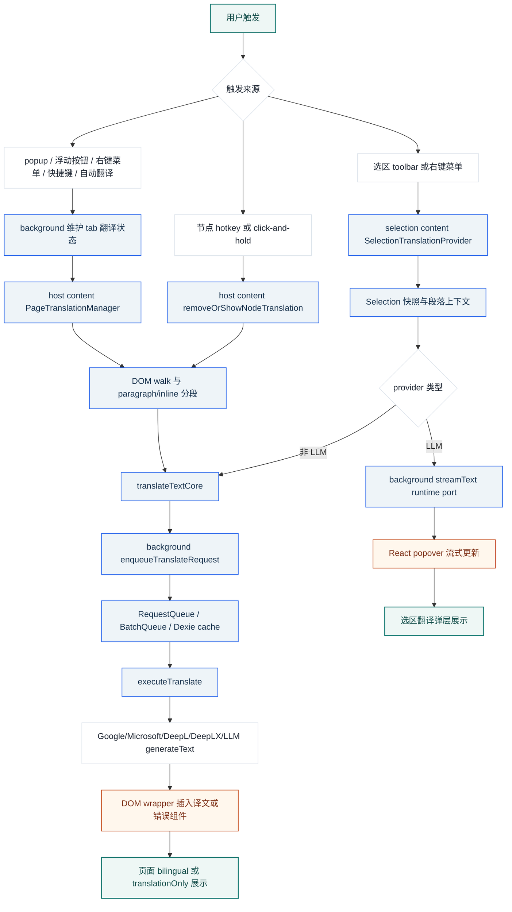

# read-frog 翻译实现研究报告

## 摘要

read-frog 的翻译功能不是一个简单的 `translate(text)` 调用，而是一个浏览器扩展里的多上下文流水线：入口层触发、background 同步状态和调度请求、content script 抽取 DOM/selection 文本、provider 层执行翻译、展示层把结果插入页面或弹层。

核心结论如下：

- 整页/节点翻译的主链路是 `PageTranslationManager + DOM walker + background translation queue + DOM wrapper insertion`。
- 选区翻译是单独的 React 弹层链路，LLM provider 支持 background streamText 流式输出。
- 文本输入采用“局部文本 + 可选网页上下文”：页面按 DOM 段落懒翻译，LLM 可加入网页标题、正文片段和摘要。
- 请求层支持 Google/Microsoft、DeepL/DeepLX 和多种 LLM provider；页面翻译走队列、缓存、限速、重试和 LLM 批处理。
- 最适合复用的是 provider、prompt、队列、缓存和流式通信思路；最需要谨慎迁移的是 content script 的 DOM 回填、ShadowRoot/iframe 处理和 WXT message/storage 绑定。

## 研究对象与版本范围

研究对象是 GitHub 仓库 `https://github.com/mengxi-ream/read-frog`。本次以 2026-05-30 可获取的默认分支源码为准，远端 `HEAD` 与本地克隆均核验为：

`c9b157ad56a42d2ba691cbbbbc9859d378802f5d`

最近提交时间为 `2026-05-28T11:33:52-07:00`，项目包名为 `@read-frog/extension`，版本为 `1.33.11`。项目形态是 WXT 驱动的 Manifest V3 浏览器扩展，主要使用 React、Jotai、AI SDK 和 Dexie。

限制说明：GitHub REST API 匿名请求触发 rate limit，`sn-search-code` 的 GitHub 脚本因缺少 `httpx` 未成功执行，所以 issue/讨论覆盖不足。本报告的判断主要来自源码和项目配置。

## 翻译链路总览

下图展示 read-frog 翻译从入口触发到结果展示的主流程。它刻意区分了页面/节点翻译和选区翻译，因为两者在请求与展示层有不同取舍。

读者应带走的判断是：页面翻译和选区翻译共享 provider/prompt 等底层能力，但不是完全同一条链路。页面翻译偏批量、缓存和 DOM 回填；选区 LLM 翻译偏流式、可取消和弹层交互。

### 调用链路表

| 场景 | 入口 | 文本来源 | 请求路径 | 展示方式 | 关键特性 |
|---|---|---|---|---|---|
| 整页翻译 | popup、浮动按钮、右键菜单、快捷键、自动翻译 | DOM paragraph / inline group | `PageTranslationManager -> translateWalkedElement -> translateTextForPage -> translateTextCore -> enqueueTranslateRequest -> executeTranslate` | 页面中插入 wrapper | 懒加载、缓存、LLM 批处理、可停止清理 |
| 节点翻译 | hotkey 或 click-and-hold | 鼠标坐标命中的 block node | `removeOrShowNodeTranslation -> walkAndLabelElement -> translateWalkedElement -> translateTextCore` | 页面中局部插入或切换译文 | 复用整页 DOM 翻译核心 |
| 选区翻译 LLM | selection toolbar 或右键菜单 | `window.getSelection()` 和段落上下文 | `SelectionTranslationProvider -> streamBackgroundText -> background streamText` | React popover 流式展示 | thinking、chunk 更新、AbortController 取消 |
| 选区翻译非 LLM | selection toolbar 或右键菜单 | 选区文本 | `translateWithStandardProvider -> translateTextCore -> background queue` | React popover 一次性展示 | 复用队列与缓存 |
| Translation Hub | 用户输入文本 | 输入框文本 | `TranslationCard -> executeTranslate` | 应用 UI 内展示 | 更像普通文本翻译工具，不是页面 DOM 主线 |

## 核心实现拆解

### 1. 入口与状态同步

read-frog 把页面翻译入口做成“多入口、单状态”。popup、浮动按钮、右键菜单、快捷键、自动翻译都不直接处理 DOM 翻译，而是通过 background 消息修改或查询 tab 级翻译状态。background 再通知对应 tab 的 host content script，由 `PageTranslationManager` start/stop。

关键文件：

- `src/entrypoints/popup/components/translate-button.tsx`
- `src/entrypoints/side.content/components/floating-button/translate-button.tsx`
- `src/entrypoints/background/context-menu.ts`
- `src/entrypoints/background/translation-signal.ts`
- `src/entrypoints/background/page-translation-state.ts`
- `src/entrypoints/host.content/runtime.ts`
- `src/entrypoints/host.content/translation-control/page-translation.ts`

这种设计让 popup、浮动按钮和 content UI 可以共享同一个 enabled 状态，也方便处理 iframe 注入、tab 移除、同源导航 restart 和跨源导航 stop。

### 2. 文本抽取与上下文构造

页面翻译不是一次性发送整页文本。`PageTranslationManager` 先 walk `document.body`，标记 paragraph、block、inline 等节点，再用 IntersectionObserver 观察进入视口附近的 top-level paragraph。MutationObserver 会处理新增节点和隐藏元素变为可见的情况。

文本抽取主线是：

- `walkAndLabelElement` 标记可翻译 DOM；
- `extractTextContent` 从节点递归抽取文本；
- `translation-walker` 按 paragraph 和连续 inline/text 节点组合翻译任务；
- 过滤隐藏元素、`notranslate`、无效标签、纯数字、小段落和重复翻译节点。

选区翻译走另一套输入构造：`readSelectionSnapshot` 保存选中文本和 range，`buildContextSnapshot` 收集选区所在段落文本。LLM 且开启 AI content-aware 时，还会通过 Defuddle 抽取网页正文，截断为上下文，并可生成网页摘要。

### 3. Provider、Prompt 与请求执行

provider 大致分为三类：

- 非 API 翻译：`google-translate`、`microsoft-translate`；
- 翻译 API：`deeplx`、`deepl`；
- LLM provider：OpenAI、DeepSeek、Gemini、Anthropic、OpenRouter、Ollama、Tensdaq、SiliconFlow、Volcengine、MiniMax、Alibaba、Moonshot、HuggingFace 等。

执行分流集中在 `src/utils/host/translate/execute-translate.ts`。LLM 翻译使用 AI SDK；页面/节点的 LLM 非流式路径用 `generateText`，选区 LLM 流式路径用 background 的 `streamText`。

prompt 不是硬编码一句话，而是模板化配置。默认翻译 prompt 支持：

- `{{targetLanguage}}`
- `{{input}}`
- `{{webTitle}}`
- `{{webContent}}`
- `{{webSummary}}`

批处理模式会追加 `%%` 分隔规则，要求输出数量与输入数量匹配。`BatchQueue` 在数量不匹配时重试，并可回退为单条请求。

### 4. 队列、缓存与持久化

页面/节点翻译请求进入 background 的 `translation-queues.ts`。这里做了几件关键事：

- 先查 Dexie `translationCache`；
- LLM provider 使用 `BatchQueue` 合并短文本请求；
- 非 LLM provider 使用 `RequestQueue` 控制速率、超时和重试；
- 成功后把规范化翻译结果写回缓存；
- 网页/字幕摘要写入 `articleSummaryCache`。

缓存会按 7 天过期策略自动清理，options 页面也提供手动清空翻译相关缓存的入口。缓存 key 包含文本、providerConfig、语言、prompt、AI content-aware 开关和上下文片段等信息，目标是降低不同配置之间的误命中。

### 5. 结果回填与 UI 状态

页面/节点翻译直接改宿主页面 DOM。它有两种模式：

- bilingual：保留原文，在目标节点后或内部插入 `notranslate` wrapper，再追加译文 span。
- translationOnly：保存父节点原始 `innerHTML`，创建 `display: contents` wrapper，写入译文 HTML，并移除原始 child nodes。

loading 状态使用轻量 DOM spinner。翻译失败时，wrapper 内会挂载 `TranslationError` React shadow host，显示重试按钮和错误详情。重试按钮按当前翻译模式重新调用 `translateNodesBilingualMode` 或 `translateNodeTranslationOnlyMode`。

选区翻译不改原文 DOM。`SelectionTranslationProvider` 使用 React state 管理 `isTranslating`、`translatedText`、`thinking`、`error`、`rerunNonce` 和 `AbortController`。LLM 流式输出到达时逐步更新弹层文本；关闭弹层或重新生成会取消当前请求。

## 核心源码文件与职责矩阵

| 模块 | 关键文件 | 职责 |
|---|---|---|
| 扩展入口 | `src/entrypoints/popup/components/translate-button.tsx` | popup 中切换页面翻译 |
| 扩展入口 | `src/entrypoints/side.content/components/floating-button/translate-button.tsx` | 页面浮动按钮触发页面翻译 |
| 右键菜单 | `src/entrypoints/background/context-menu.ts` | 页面翻译、选区翻译等右键入口 |
| host runtime | `src/entrypoints/host.content/runtime.ts` | 挂载 host content、注册 manager、节点触发器、快捷键 |
| 页面翻译 manager | `src/entrypoints/host.content/translation-control/page-translation.ts` | start/stop/restart、observer、title 翻译、DOM 清理 |
| 节点翻译 | `src/entrypoints/host.content/translation-control/node-translation.ts` | 注册节点翻译触发，按需注入 iframe |
| DOM walk | `src/utils/host/dom/traversal.ts` | 标记节点、抽取文本 |
| DOM filter | `src/utils/host/dom/filter.ts` | 判断可走、可翻译、block/inline、隐藏和 notranslate |
| 翻译 walker | `src/utils/host/translate/core/translation-walker.ts` | 将已标记节点拆成翻译任务 |
| 翻译模式 | `src/utils/host/translate/core/translation-modes.ts` | bilingual / translationOnly 回填逻辑 |
| DOM 插入 | `src/utils/host/translate/dom/translation-insertion.ts` | 创建译文节点、决定 inline/block、应用样式 |
| DOM 清理 | `src/utils/host/translate/dom/translation-cleanup.ts` | 删除 wrapper、恢复 translationOnly 原文 |
| 请求入口 | `src/utils/host/translate/translate-text.ts` | 构造 hash/context，向 background 入队 |
| provider 分流 | `src/utils/host/translate/execute-translate.ts` | 根据 provider 类型调用具体翻译实现 |
| LLM 翻译 | `src/utils/host/translate/api/ai.ts` | AI SDK `generateText` 非流式翻译 |
| prompt | `src/utils/prompts/translate.ts` | 翻译 prompt 模板与 batch 规则 |
| 队列与缓存 | `src/entrypoints/background/translation-queues.ts` | RequestQueue、BatchQueue、Dexie cache、摘要缓存 |
| 流式输出 | `src/entrypoints/background/background-stream.ts` | runtime port + AI SDK `streamText` |
| 选区翻译 | `src/entrypoints/selection.content/selection-toolbar/translate-button/provider.tsx` | 选区翻译状态、流式/非流式分支、取消和重跑 |
| 选区展示 | `src/entrypoints/selection.content/selection-toolbar/translate-button/translation-content.tsx` | loading、thinking、译文、复制和朗读 |
| 状态同步 | `src/entrypoints/background/translation-signal.ts` | tab 状态、iframe 同步、语言检测联动 |
| 缓存库 | `src/utils/db/dexie/app-db.ts` | `translationCache`、`articleSummaryCache` 等 Dexie 表 |

## 关键设计判断

### 判断一：页面翻译的核心是 DOM 生命周期管理

真正复杂的部分不在“调用哪个翻译 API”，而在如何从网页中稳定地找到可翻译文本、分段、避免重复翻译、插入译文、处理动态页面、停止时清理，并尽量不破坏宿主页面。`PageTranslationManager`、DOM traversal/filter、translation walker 和 wrapper restore 才是整页翻译体验的核心。

### 判断二：LLM 上下文感知是对分段翻译的补偿

页面按段落懒翻译可以降低成本、提高响应速度和缓存命中，但会损失跨段语境。read-frog 用网页标题、正文片段和摘要补充 prompt，试图在不把整页一次性发给模型的情况下改善术语和上下文一致性。

### 判断三：选区翻译优先交互即时性

选区 LLM 翻译不走页面翻译的 batch queue，而是走 background streamText。这样做牺牲了部分缓存/批处理收益，但换来逐步展示、thinking 状态和可取消的用户体验。

### 判断四：provider 抽象是统一配置，不是统一协议

源码把多种 provider 放在统一配置体系里，但 Google/Microsoft、DeepL/DeepLX、LLM 的执行方式差异很大。复用时不能假设只写一个 adapter 就能覆盖所有 provider，仍要处理语言码、鉴权、baseURL、headers、响应格式和错误行为。

## 风险与复用建议

| 分类 | 内容 | 建议 |
|---|---|---|
| 可直接学习 | provider 分流、prompt token、AI SDK 接入、RequestQueue/BatchQueue、Dexie 缓存、stream port | 适合作为其它翻译工具的工程骨架参考 |
| 需要适配 | DOM traversal/filter、IntersectionObserver 懒翻译、wrapper 插入、ShadowRoot/iframe 处理 | 只在目标环境也是浏览器扩展或 content script 时迁移 |
| 高风险 | translationOnly 保存和恢复 `innerHTML`、直接移除原始 child nodes | 复杂前端页面可能丢事件绑定或破坏框架内部状态，迁移前需要大量实测 |
| 架构绑定 | WXT message/storage、browser runtime port、extension permissions、i18n、analytics、toast 和 UI 组件 | 抽象通信层、配置层和持久化层后再复用 |
| 外部不确定性 | Google/Microsoft 非官方或边缘接口、各 LLM provider 真实错误格式和限流 | 不要只依赖源码判断可用性，落地前要做 provider 级集成测试 |

## 不确定性

- 本报告未运行真实浏览器样本，对复杂 SPA、ShadowRoot、iframe、hydration 和 translationOnly 恢复的稳定性判断限于源码分析。
- 未实测外部 provider 的可用性、速度、费用、限流和错误格式。
- 选区 LLM 流式路径未明显复用 `translationCache`，源码不能确认这是刻意设计还是待优化点。
- provider/model 列表随项目版本可能变化，本报告只覆盖 `main@c9b157ad`。

## 结论

如果只想理解 read-frog“翻译如何实现”，可以把它压缩成一句话：它在浏览器扩展的 background/content/selection 多上下文之间，把 DOM 或选区文本抽取成局部翻译任务，通过 provider/prompt/queue/cache/stream 层执行翻译，再把结果以 DOM wrapper 或 React popover 的形式展示给用户。

如果要复用，优先抽取请求执行层和队列缓存层；如果要复用整页翻译体验，必须连同 DOM 生命周期、状态同步、错误恢复和页面兼容性一起设计，不能只搬 provider 调用代码。
